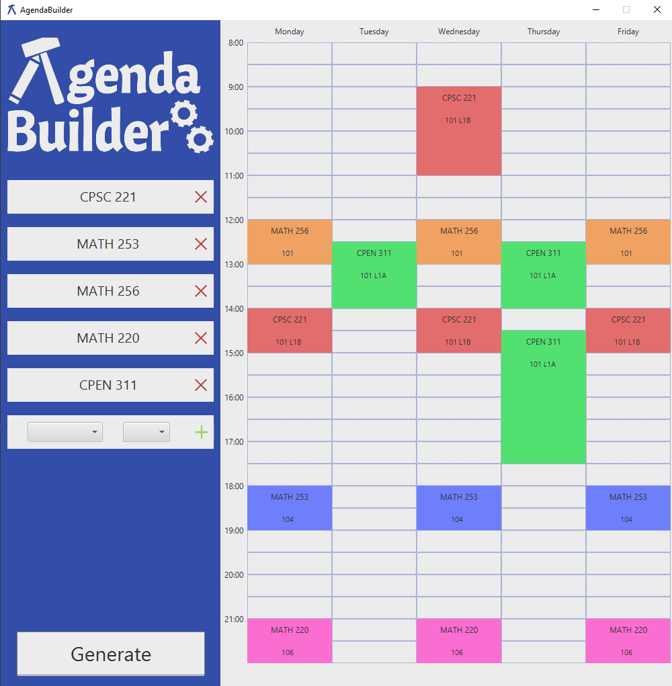

# AgendaBuilder
AgendaBuilder is a java application which assists post-secondary students with the course scheduling process.

After a student determines the courses they want to register for, they must choose sections such that there no course conflict exist. The vast number of sections can make this scheduling process time-consuming and tedious. AgendaBuilder allows a student to select the courses they plan on registering for and attempts to generate a valid combination of sections. Currently, AgendaBuilder supports the University of British Columbia.

## Screenshots
Below is a showcase of the AgendaBuilder in action.

## Installation and Setup Instructions
Clone this repository.   
Add the Maven library `hu.blackbelt.bundles.poi:org.apache.poi:4.0.1_1` to your project (used to parse an excel file): https://mvnrepository.com/artifact/hu.blackbelt.bundles.poi/org.apache.poi/4.0.1_1.  
Make sure to install JavaFX: https://openjfx.io/openjfx-docs/.  

To start HyperShopper:  
Run the main method in `MainGUI.java`

To add more courses:  
The `course_data` directory has 1) an excel file with course section and timing information, and 2) a text file containing all the possible courses the user can select from.  Both files should be edited in order to add additional courses.

## Reflection
AgendaBuilder is an application which schedules university courses. The goal of the project is to assist students with selecting course sections such that no course conflicts exist. A user can select a maximum of six courses, and AgendaBuilder will search for a valid combination of sections and display them on a timetable. Although the project presented its difficulties, it also taught us many valuable lessons.

One of the toughest challenges of this project was determining a method to solve the scheduling problem. Our first idea was to use graph coloring. Each vertex represented a course section and there was an edge between two sections if they conflicted with each other. After coloring the graph, each color group would represent non-conflicting sections and could be used to generate the schedule. However, we realized that there was a possibility of a color group containing all the sections of a particular course, which would prevent us from finding a solution even when one existed. Our second approach was to use genetic algorithms. We could generate many random schedules and continue to evolve them, maximizing a fitness function, until an adequate solution was found. Although this may have been successful, we realized that our scheduling problem was not as complex as we first thought. It is extremely rare for a student to take more than six courses, and each course has an average of around 10 sections, which meant that we would need to check 10^6 combinations at most. This is very possible to do in a reasonable amount of time, and to avoid over-complicating our solution, we decided to implement this method.

This project helped develop our collaboration and teamwork skills. We learned to delegate tasks to each other and learned merge our ideas together. In addition, by the end of this project, we realized that we spent a lot of time implementing unsuccessful ideas, instead of spending time to better understand the problem, and properly plan and criticize our designs. This is a lesson we hope will encourage organization and reduce delays in future projects. 

Currently, AgendaBuilder only supports the University of British Columbia. However, in the future, we hope to add more support for other schools. Another improvement we could make would be to take peoples’ work and leisure agendas into consideration. Furthermore, we could also optimize schedules based on breaks in between classes, lateness of classes, location of classes, and more. Lastly, we would like to create a UBC API that will return course information, rather than relying on an excel database. This would allow all courses to be selectable and provide the most up to date information regarding course availability. 

This project has helped us gain more experience with object oriented programing and also taught us a lot of important lessons. We hope that we can utilize what we have learned and carry it forward to future projects.

Sources: 
https://www.researchgate.net/publication/325033517_University_Time_Table_Scheduling_Using_Graph_Coloring_Technique  
https://www.researchgate.net/publication/221467927_QUICK_scheduler_a_time-saving_tool_for_scheduling_class_sections

